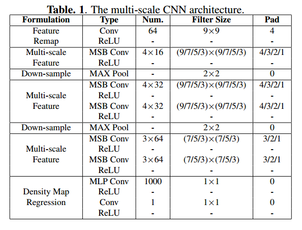
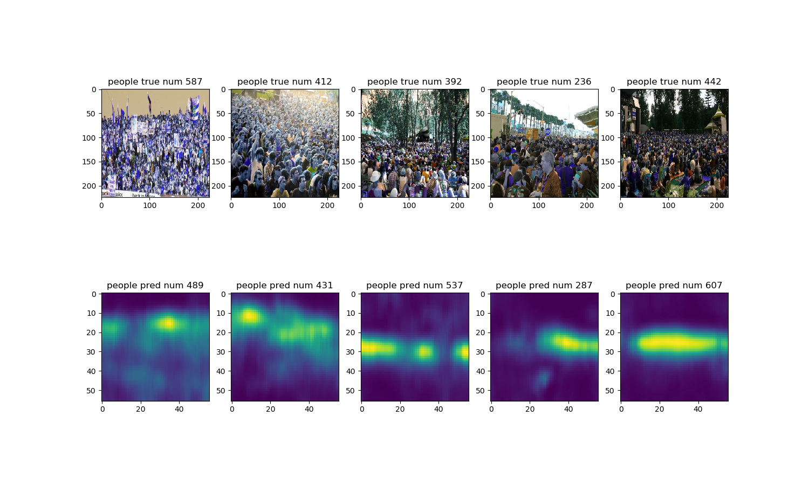

# Multi-scale Convolution Neural Networks for Crowd Counting

>更新于2020年3月
>由于最近很多人咨询这个项目，而我个人之前这个项目因为一些原因终止了，最近抽空再次完善了一下，目前的代码结构主要是在ShanghaiTech数据集下训练，得到的效果还是不错的，具体见下文。


## 项目简介
复现论文[Multi-scale Convolution Neural Networks for Crowd Counting](https://arxiv.org/abs/1702.02359)。考虑到目前还没有具体写的比较完善的基于Keras的复现，这对于迅速成型的顶层系统的构建不太方便。本项目使用的是TensorFlow2中Keras的API，不建议使用单独的Keras，本项目设计在多个数据集上进行训练测试，模型泛化能力强，实际主要ShanghaiTech数据集上训练获得模型。


## 数据集下载
- ShanghaiTech Dataset
  - [下载地址](https://drive.google.com/open?id=1CW6PiAnLSWuUBX-2tVqQO5-1TDdilJB1)
- Mall Dataset
  - [下载地址](https://drive.google.com/open?id=170bssJjE_UbGeGSc_s2WHGBtbDAZRd7t)
- The_UCF_CC_50 Dataset
  - [下载地址](https://drive.google.com/open?id=1MwfTXFQUTx_sqw-g-D7TDOox1S88XYVN)
- 地址说明
  - 不提供数据集官方地址，数据集均放置在我的谷歌云盘，开启共享，无法访问的可以[邮箱](mailto:luanshiyinyang@gmail.com)联系我，我将提供百度网盘地址。


## 论文说明
针对深度神经网络近几年的发展以及现有的网络模型难以优化以及计算耗时，主要提出了multi-scale blob模块（类Inception结构）进行相关特征的提取。

作者主要提出了MSCNN的网络结构，该结构比起MCNN具有更好的处理能力及效果且参数量大幅度缩减，并且纵向对比了LBP+RR、MCNN+CCR等模型。

具体[论文文件](/assets/1702.02359.pdf)可以直接访问。
## 环境配置
- 基于Python3.6
- 需要第三方包已在[requirements](/requirements.txt)列出
  - 切换到requirements文件所在目录，执行命令`pip install -r requirements.txt`即可配置环境
- 脚本运行说明
	- 训练
		- 命令行执行
			- `python train.py -b 16`
		- 更详细的选项可以执行`python train.py -h`查看帮助
	- 测试
    	- 命令行执行
    		- `python test.py -s yes`
		- 更详细的选项可以执行`python test.py -h`查看帮助


## 模型构建
针对之前出现的损失大幅降低但密度图预测全0的情况，主要是由于回归器层激活函数不当，为了获得更好的收敛结果，最后一层的激活函数调整如下。

$$output = Relu(Sigmoid(x))$$

使用Keras的Function API构建模型的代码如下，更具体的可以查看文末的Github地址。
```python
def MSCNN(input_shape=(224, 224, 3)):
    """
    模型构建
    本论文模型简单
    :param input_shape 输入图片尺寸
    :return:
    """
    input_tensor = Input(shape=input_shape)
    # block1
    x = Conv2D(filters=64, kernel_size=(9, 9), strides=1, padding='same', activation='relu')(input_tensor)
    # block2
    x = MSB(4*16)(x)
    x = MaxPooling2D(pool_size=(2, 2), strides=(2, 2))(x)
    # block3
    x = MSB(4*32)(x)
    x = MSB(4*32)(x)
    x = MaxPooling2D(pool_size=(2, 2), strides=(2, 2))(x)

    x = MSB_mini(3*64)(x)
    x = MSB_mini(3*64)(x)

    x = Conv2D(1000, (1, 1), activation='relu', kernel_regularizer=l2(5e-4))(x)

    x = Conv2D(1, (1, 1))(x)
    x = Activation('sigmoid')(x)
    x = Activation('relu')(x)

    model = Model(inputs=input_tensor, outputs=x)
    return model
```

**注意，输出层不能使用传统的Relu，会输出陷入“死区”，导致预测均为0值且loss确实在不断降低。**
### 结构概念图

### 结构配置图



## 模型训练
### 训练数据集
主要在ShanghaiTech上训练，其余数据集类似封装data loader即可完成训练或者测试。
### 训练效果展示（模型简单训练5轮）
对ShanghaiTech验证集随机5张图片进行人群密度估计，结果如下，可以看到，收敛的效果还是不错的，想要获得更好的效果则需要更为细致的训练调整。




## 补充说明
训练完成的预训练模型可以在网盘下载，下载后放置在models文件夹即可。完整代码已经上传到我的Github，欢迎Star或者Fork。如有错误，欢迎指正。
